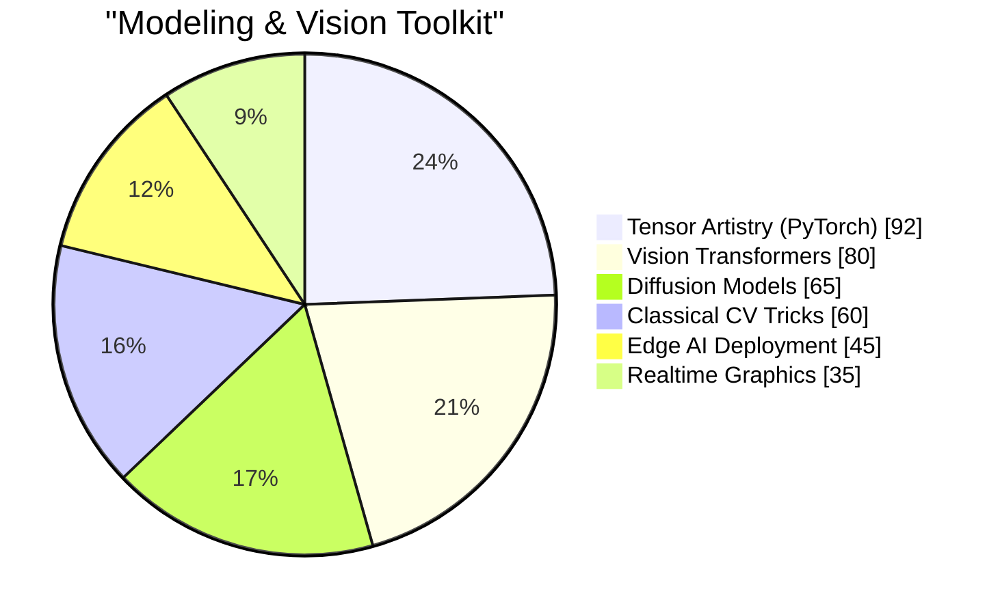

<details open>
  <summary><h1 align="center">o(>.<)o Heyo, I'm <code>steinsgo</code>!</h1></summary>
  <p align="center">"If pixels can dream, I want to be the one who hands them the story."</p>
</details>

---

### 🌌 Who am I?
* 📜 A **Computer Science voyager** currently charting a Master of Artificial Intelligence @ [`TODO: University`](https://example.edu).
* 🧪 A **computer-vision tinkerer** obsessed with:
  * 🧼 Image restoration that scrubs away noise + time.
  * 🔍 Super-resolution that persuades pixels to upscale their ambitions.
  * 🎯 Object detection that never blinks.
  * 🎞️ Video generation that conjures motion from silence.
* 🎛️ A **sound addict** riffing on electric guitar, fusion, and modern jazz harmonies.
* ☕ A **midnight brewer** whose espresso shots double as GAN fuel.

> "I am just who I am, nothing more, nothing less... but always in high resolution." 😎


<details>
  <summary><strong>🎖️ Hidden Lore</strong></summary>

  * Former `TODO: Degree` candidate @ [`TODO: Previous School`](https://example.edu).
  * Semi-pro tactical FPS fragger who still speed-runs aim maps between experiments.
  * Parkour enthusiast warming up by vaulting over convolutional layers.
</details>

---

### 📊 Telemetry Dashboard
<p align="center">
  
  
  
  
</p>

---

### 🧠 Skill Readout


<sub>Prefer bars? Swap this block back to text or a custom SVG badge wall. You do you.</sub>

| Research Vector | Current Quest | Status |
| --- | --- | --- |
| 🧬 Low-light restoration | Remixing datasets with generative priors. | `in flight` |
| 🔁 Diffusion + SR fusion | Building cinematic upscaling loops. | `in the lab` |
| 🧩 Promptable detection | Architecting open-set detection heads. | `mind mapping` |
| 🎞️ Video imagination | Storyboarding temporally coherent dreams. | `whiteboarded` |

---

### 🗃️ Papers, Notes & Academic Signals
> Reserved runway for future triumphs — plug in your milestones below.
>
> - `TODO: Paper Title @ Venue`
> - `TODO: Preprint / DOI`
> - `TODO: Thesis or Capstone`

- 🎓 `TODO: Current School / Lab`
- 🧭 `TODO: Program timeline`
- 🧑‍🤝‍🧑 `TODO: Advisor / Lab mates`

---

### 🎶 Off-Stage Improvisations
<details open>
  <summary>What happens when the GPU cools down?</summary>

  - ⚡ Plug in the **electric guitar**, chase odd-time signatures, and bend notes like Bézier curves.
  - 🎷 Spin **modern jazz** vinyl while transcribing spicy voicings.
  - 🎮 Queue up a game night — from Nintendo nostalgia to tactical FPS showdowns.
  - 📸 Capture city neon on a lone mirrorless camera.
</details>

---

### 📡 Signal Beacons
<p align="center">
  <a href="https://www.linkedin.com/"></a>
  <a href="https://your-portfolio.example"></a>
  <a href="https://instagram.com/"></a>
  <a href="https://space.bilibili.com/"></a>
</p>

<p align="center">
  <i>If you're good, you'll tell everyone.<br><strong>If you're great, they'll tell you.</strong></i>
</p>

---

<details>
  <summary><strong>🎮 Steam Playtime Leaderboard</strong></summary>

```text
🔫 Counter-Strike 2                 🕘 0000 hrs 00 mins
🎮 Monster Hunter: World            🕘  000 hrs 00 mins
🍳 PUBG: BATTLEGROUNDS              🕘  000 hrs 00 mins
🦾 Cyberpunk 2077                   🕘  000 hrs 00 mins
🎮 ELDEN RING                       🕘  000 hrs 00 mins
```
<sub>Update with your own stats via https://github.com/YouEclipse/steam-box</sub>
</details>

---

<p align="center">
  <code>git commit -m "Craft dreams in 4K"</code>
</p>
