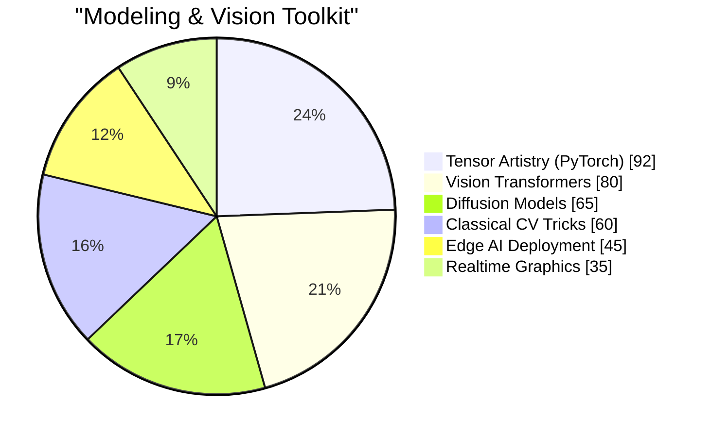

  
<h1 align="center">o(>.<)o Heyo, I'm <code>steinsgo</code>!</h1>

  
"If pixels can dream, I want to be the one who hands them the story."

---

### 🌌 Who am I?
* 📜 A **Computer Science voyager** currently charting a bachelor of Computer Science@ [Macau University Of Science And Technology](https://www.must.edu.mo/).
* 🧪 A **computer-vision tinkerer** obsessed with:
  * 🧼 Image restoration that scrubs away noise + time.
  * 🔍 Super-resolution that persuades pixels to upscale their ambitions.
  * 🎯 Object detection that never blinks.
  * 🎞️ Video generation that conjures motion from silence.
* 🎛️ A **sound addict** riffing on electric guitar, fusion, and modern jazz harmonies.
* ☕ A **midnight brewer** whose espresso shots double as GAN fuel.

> "I am just who I am, nothing more, nothing less... but always in high resolution." 😎

---

### 📊 Telemetry Dashboard

  
  
  
  

---

### 🧠 Skill Readout

Prefer bars? Swap this block back to text or a custom SVG badge wall. You do you.

| Research Vector | Current Quest | Status |
| --- | --- | --- |
| 🧬 Low-light restoration | Remixing datasets with generative priors. | `in flight` |
| 🔁 Diffusion + SR fusion | Building cinematic upscaling loops. | `in the lab` |
| 🧩 Promptable detection | Architecting open-set detection heads. | `mind mapping` |
| 🎞️ Video imagination | Storyboarding temporally coherent dreams. | `whiteboarded` |

---

### 🗃️ Papers, Notes & Academic Signals
> Reserved runway for future triumphs — plug in your milestones below.
>
> - `TODO: Paper Title @ Venue`
> - `TODO: Preprint / DOI`
> - `TODO: Thesis or Capstone`

- 🎓 `TODO: Current School / Lab`
- 🧭 `TODO: Program timeline`
- 🧑‍🤝‍🧑 `TODO: Advisor / Lab mates`

---

### 🎶 Off-Stage Improvisations

  
What happens when the GPU cools down?

  - ⚡ Plug in the **electric guitar**, chase odd-time signatures, and bend notes like Bézier curves.
  - 🎷 Spin **modern jazz** vinyl while transcribing spicy voicings.
  - 🎮 Queue up a game night — from Nintendo nostalgia to tactical FPS showdowns.
  - 📸 Capture city neon on a lone mirrorless camera.

---

### 📡 Signal Beacons

  <i>If you're good, you'll tell everyone. <strong>If you're great, they'll tell you.</strong></i>

